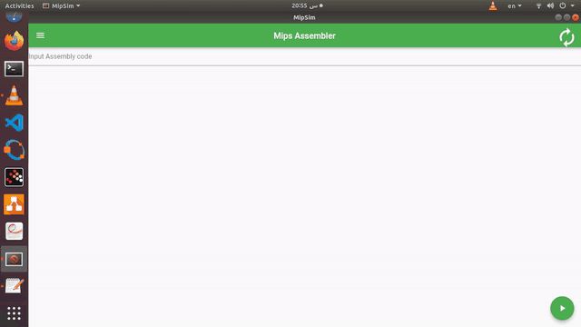

# MipSim
MipSim is assembler for Mips processor pipeline using Flutter desktop for linux. It's project in computer organization (3rd year Computer Engineering).
 


## Contents
* Team members
* pre-installs

## Team members
* Mohamed Elesaily
* Mahmoud Ashraf
* Khalid Muhammad
* Mahmoud Swillam
* Mohamed Hamada
* Hady Ashraf
* Mohamed Ramdan

## pre-installs
You should download MipsSim folder then run:
```
sudo apt-get install -y iverilog
sudo apt-get install gtkwave


```
